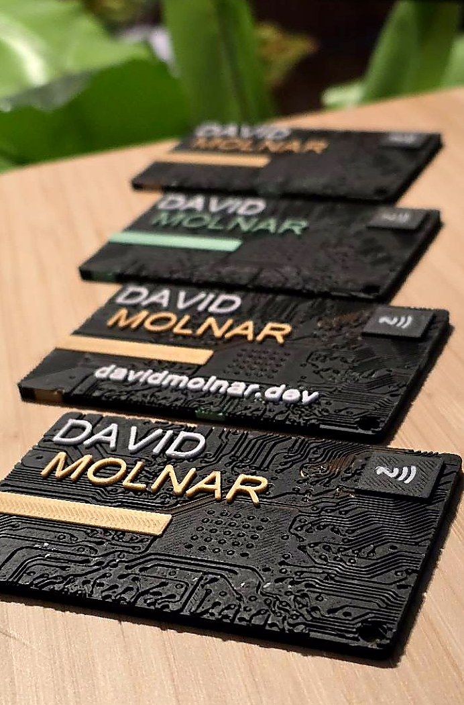

# NFC Business Card



Customized 3D printed NFC business card for Dávid Molnár.

The production NFC tag should be programmed with this exact URL:

```text
https://davidmolnar.dev/addcontact
```

`/addcontact` opens the mobile contact page with the add/save contact button. Do not program older test endpoints such as `/c`, `/contact`, or `/contact.vcf` onto new physical NFC tags.

## Current Files

- `bambu/davidmolnar-dev-business-card-public.3mf` - current Bambu Studio project file
- `assets/preview.jpg` - public product preview image
- `assets/qr-addcontact.svg` - QR code for the production contact URL
- `assets/qr-addcontact.png` - phone-testable QR image for the production contact URL
- `docs/design-decisions.md` - NFC/contact-flow decisions from the project conversations
- `docs/print-workflow.md` - Bambu Studio and NFC programming workflow
- `tools/generate_qr_assets.py` - regenerates the `/addcontact` QR assets

## Regenerate QR Assets

```bash
python tools/generate_qr_assets.py
```

## Print Notes

Open `bambu/davidmolnar-dev-business-card-public.3mf` in Bambu Studio. The original profile was designed for a 0.2 mm NFC tag sticker workflow with a pause for inserting the tag.

Use `docs/print-workflow.md` for the current print and NFC programming checklist.

## Attribution

This card is a customized derivative of:

- Original design: `Fancy Tech NFC Business Card - Fully Customizable`
- Designer: `EricP`
- Source: https://makerworld.com/hu/models/2335591-fancy-tech-nfc-business-card-fully-customizable#profileId-2554972

## License

This repository uses split licensing:

- 3D design assets and previews derived from the MakerWorld model are under CC BY-SA 4.0.
- Utility scripts in `tools/` are under MIT.

See `LICENSE.md` for details.
